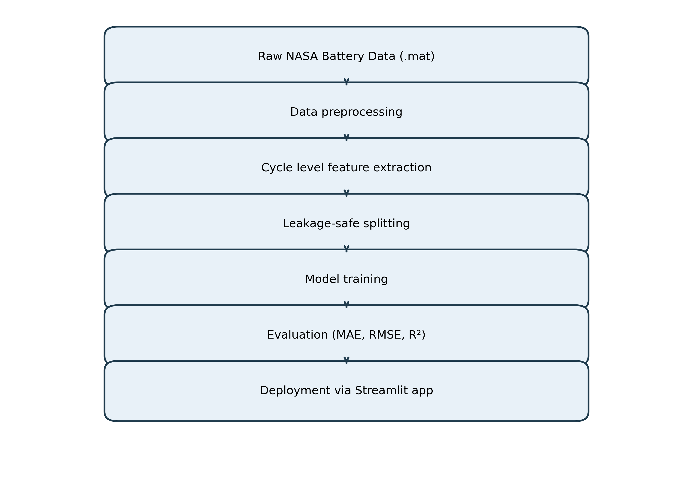
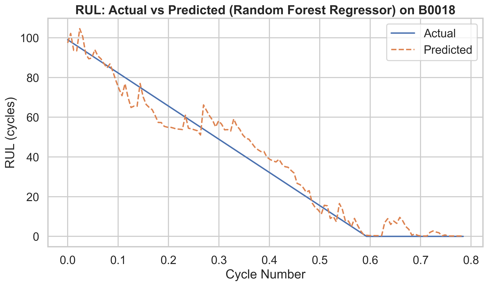

# Engineering_EV_Battery_Degradation


Battery degradation modeling and prognostics using the NASA PCoE Li-ion aging dataset, with leakage-safe evaluation and deployment-ready artifacts.

## Leakage Prevention Strategy
To ensure valid evaluation, the project follows this protocol:

1. No random splitting across cycles from the same battery.
2. Within-battery temporal ordering is preserved.
3. Battery-level holdout split is used for unseen-battery generalization (`B0018` test battery).
4. Feature engineering uses cycle history and lagged information only.
5. Scaling is fit on training batteries only and then applied to test battery.

## Pipeline Overview


## Quick Result Snapshot


## Dataset
**NASA Ames Prognostics Center of Excellence (PCoE)**  
**Lithium-ion Battery Aging Dataset**

- NASA source: https://data.nasa.gov/dataset/li-ion-battery-aging-datasets
- Kaggle mirror: https://www.kaggle.com/datasets/patrickfleith/nasa-battery-dataset

Expected raw files in `data/raw/`:
- `B0005.mat`
- `B0006.mat`
- `B0007.mat`
- `B0018.mat`

## Project Structure
```text
Engineering_EV_Battery_Degradation
│
├── LICENSE
├── README.md
├── requirements.txt
├── environment.yml
│
├── data
│   └── README.md
│
├── notebooks
│   ├── 01_eda.ipynb
│   ├── 02_baseline_model.ipynb
│   ├── 03_feature_engineering.ipynb
│   ├── 04_models.ipynb
│   └── 05_interpretability.ipynb
│
├── src
│   ├── features.py
│   ├── train.py
│   ├── evaluate.py
│   ├── reporting.py
│   └── leakage_audit.py
│
├── reports
│   ├── design.md
│   ├── data_dictionary.md
│   ├── problem_definition.md
│   ├── splitting_strategy.md
│   ├── feature_rationale.md
│   ├── feature_leakage_audit.md
│   ├── results_summary.md
│   └── business_value.md
│
├── docs
│   └── pipeline.png
│
├── models
│   └── (trained model artifacts)
│
├── results
│   ├── pred_vs_actual.png
│   └── metrics.csv
│
├── tests
│   ├── test_preprocessing.py
│   └── test_leakage_and_reporting.py
│
└── app
    └── app.py
```

## Installation
### pip
```bash
python -m venv .venv
source .venv/bin/activate
pip install -r requirements.txt
```

### conda
```bash
conda env create -f environment.yml
conda activate ev_battery_degradation
```

## Reproducible Pipeline
Canonical execution path:

```bash
make reproduce
```

Equivalent direct command:
```bash
python -m src.train --run-evaluation
```

Metrics/report synchronization path:
```bash
python -m src.evaluate
```

This command regenerates:
- `results/metrics.csv` (single source of truth)
- `reports/results_summary.md`
- `reports/feature_leakage_audit.md`
- README metrics snapshot block
- `results/pred_vs_actual.png`

## Exploratory Notebooks (Supplementary)
1. `notebooks/01_eda.ipynb`
2. `notebooks/02_baseline_model.ipynb`
3. `notebooks/03_feature_engineering.ipynb`
4. `notebooks/04_models.ipynb`
5. `notebooks/05_interpretability.ipynb`

## Streamlit App
```bash
streamlit run app/app.py
```

The app supports:
- Battery selection
- Cycle-range selection
- RUL prediction and plot visualization

## Results
`results/metrics.csv` is the only authoritative metrics source. All README/report tables are generated from it.

See full benchmark table in:
- `results/metrics.csv`
- `reports/results_summary.md`

### Reproducible Metrics Snapshot
<!-- AUTO_METRICS_TABLE_START -->
_Auto-generated from `results/metrics.csv`._

| Model | Task | MAE | RMSE | R² |
|---|---|---:|---:|---:|
| Random Forest Regressor | RUL | 5.0915 | 6.3732 | 0.9624 |
| XGBoost Regressor | RUL | 4.9354 | 6.3859 | 0.9623 |
| Transformer Encoder | RUL | 7.9898 | 9.1193 | 0.9076 |
| LSTM Neural Network | RUL | 29.6019 | 33.7142 | -0.2626 |
| Linear Regression | SOH | 0.0998 | 0.1160 | 0.9998 |
| XGBoost Regressor | SOH | 0.3677 | 0.5655 | 0.9945 |
| Random Forest Regressor | SOH | 0.4084 | 0.7148 | 0.9913 |
| Ridge Regression | SOH | 0.8853 | 0.9438 | 0.9847 |
| CNN-BiLSTM | SOH | 2.7868 | 3.4655 | 0.7508 |
| LSTM Neural Network | SOH | 6.1631 | 7.1446 | -0.0594 |
<!-- AUTO_METRICS_TABLE_END -->

## Future Improvements
- Physics-informed feature expansion
- Physics-informed neural networks
- Cross-dataset generalization validation
- Real EV fleet telemetry integration

## Commit Message Convention
- `feat:` feature development
- `fix:` bug fix
- `docs:` documentation update
- `refactor:` internal code cleanup
